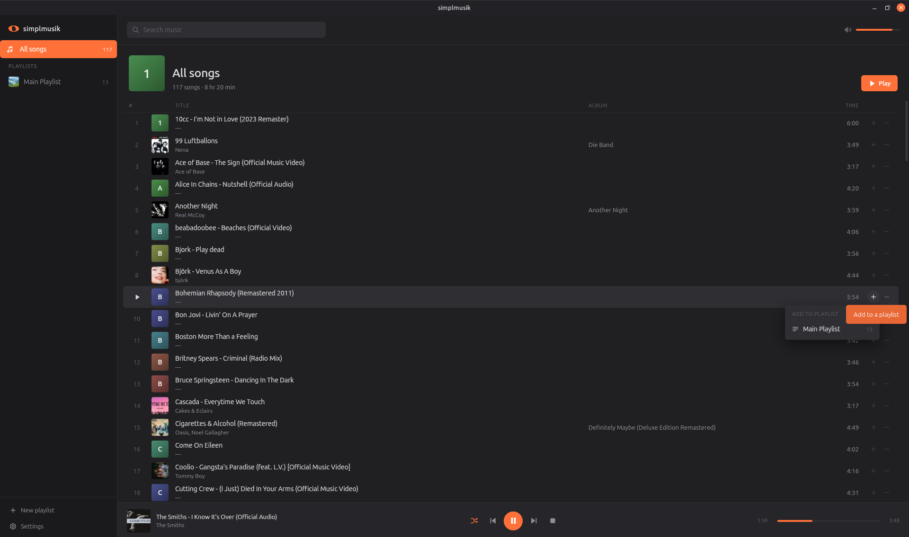
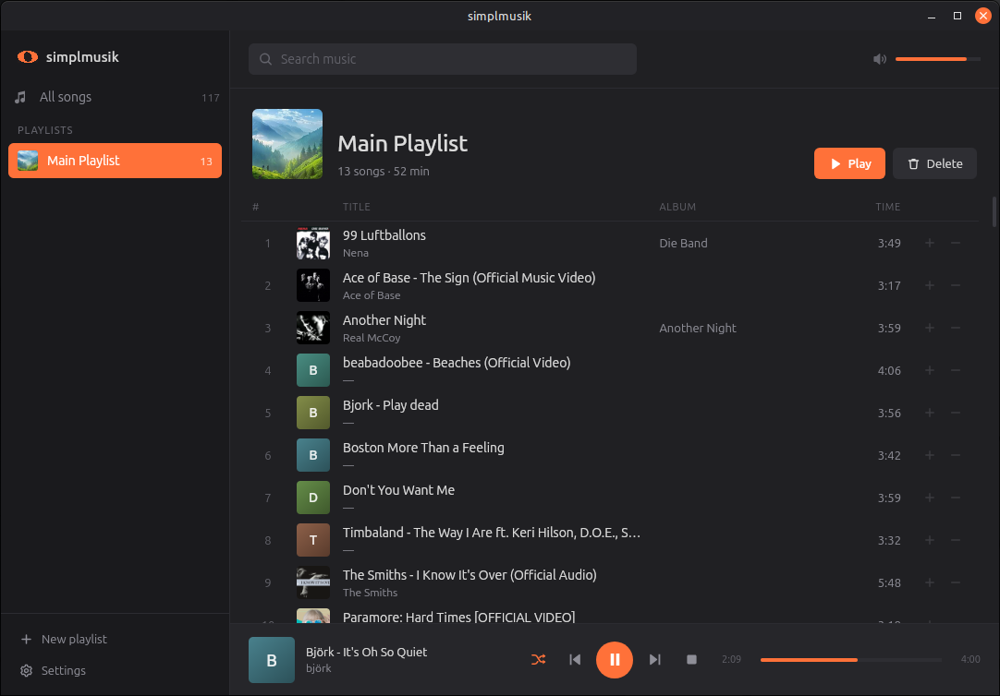
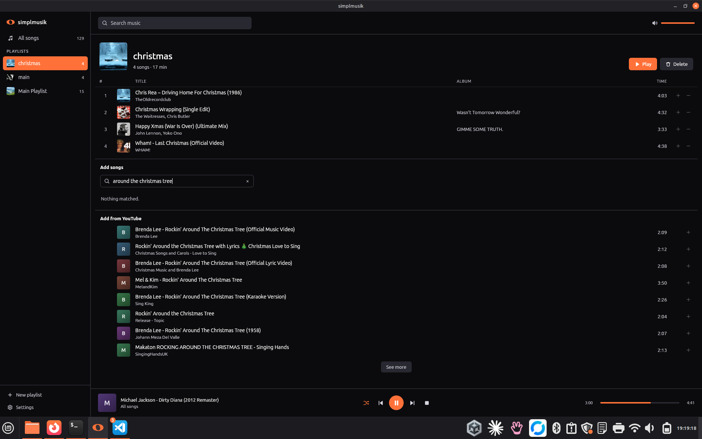

# simplmusik

A local music player. Written in Python, native to Linux.

**Any distribution - Fedora, Arch, openSUSE, Mint, Ubuntu, a Steam Deck. Carries its own mpv, WebKit and ffmpeg, so there is nothing to install first.**

[](https://github.com/JJM8/simplmusik/releases/latest/download/simplmusik.flatpak)

**Debian and Ubuntu, and the distributions built on them - Mint, Pop!\_OS, Zorin. The lighter install, because apt already has the mpv and ffmpeg it needs.**

[](https://github.com/JJM8/simplmusik/releases/latest/download/simplmusik_all.deb)

- plays the music on your own machine
- points itself at the music folder your desktop already has, and asks
  for a different one only if that comes up empty
- clean modern minimalist GUI
- a CLI aimed at agent and assistant use
- download any music for FREE, into your library or straight into a playlist
- audio levelling, so songs sit at the same volume



Playlists sit beside it, with whatever's playing along the bottom.



Search for something you haven't got and it offers to pull it down into the
playlist you're looking at.



## Install

### Flatpak

**For any distribution that has flatpak, which is all of them. Nothing to
install first - mpv, WebKit, ffmpeg and Python are all inside it, so it doesn't
care what your package manager has.**

[Download the flatpak](https://github.com/JJM8/simplmusik/releases/latest/download/simplmusik.flatpak), then:

```sh
flatpak install --user ./simplmusik.flatpak
```

The download itself is 4.5 MB, but if this is your first flatpak app it pulls
down the GNOME runtime underneath it too - about a gigabyte, once, and shared
with every flatpak you install afterwards. Press **Super**, type `music`, and
it's there.

### Debian package

**For Debian, Ubuntu, Mint, Pop!\_OS, Zorin and anything else apt-based. A 3 MB
package with nothing underneath it, because it uses the mpv and ffmpeg your
system already has.**

[Download the .deb](https://github.com/JJM8/simplmusik/releases/latest/download/simplmusik_all.deb), then:

```sh
sudo apt install ./simplmusik_all.deb
```

That's everything - apt pulls in mpv, ffmpeg and the rest, and the package
carries its own yt-dlp, because the one in the archive is too old to reach
YouTube's audio any more. Press **Super**, type `music`, and it's there.

### Keeping downloads working

YouTube changes how it hands out audio every few weeks. When downloads start
failing, that's what it is:

```sh
simplmusik update
```

### ...or build it yourself

```sh
./build-flatpak
flatpak install --user ./build/simplmusik_0.1.0.flatpak
```

```sh
./build-deb
sudo apt install ./build/simplmusik_0.1.0_all.deb
```

### ...or run it from this folder

```sh
./install
```

Adds it to the applications menu without installing anything system-wide, and
tells you what's missing. Everything stays in this folder, so keep the checkout
where it is (or re-run `./install` after moving it).

## Run

```sh
./simplmusik-ui              # the app window
./simplmusik-ui --browser    # or serve it and open your browser
```

## CLI

```sh
simplmusik status
simplmusik list
simplmusik play --shuffle
simplmusik search wonderwall
simplmusik create "Road trip"
```

Put `--json` before the command and you get JSON back, which is the point of
it: an assistant can read what came back without parsing text meant for a
person.

```sh
simplmusik --json status
```

Installed as a flatpak the CLI is in the sandbox rather than on your PATH, so
it is reached through flatpak - worth an alias if you use it much:

```sh
alias simplmusik='flatpak run --command=simplmusik org.simplmusik.Player'
```

Reading and steering a player that is already going works exactly as it does
anywhere else. Starting one is the exception: `play` hands the song to a
background player and returns, and flatpak takes the sandbox down with the
command that exits, which leaves mpv playing with nothing left to stop it. So
with the flatpak, start playback from the window - or from this alias while the
window is open. If you live in the terminal, the .deb is the better fit.

## More

DESIGNNOTES.md has the longer version.
